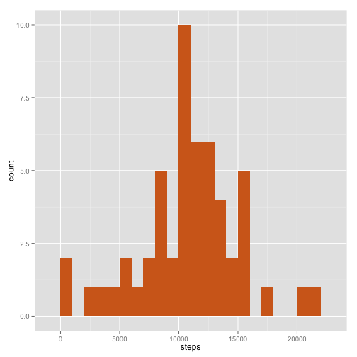
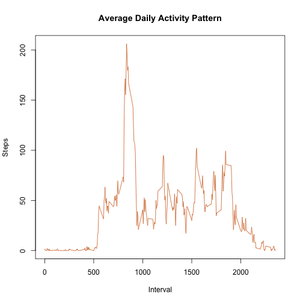
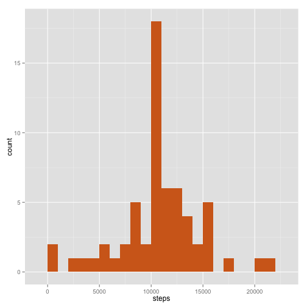
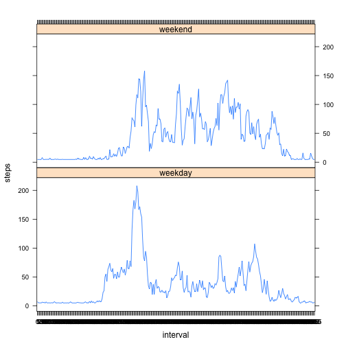

# Reproducible Research: Peer Assessment 1

_This assignment makes use of data from a personal activity monitoring device.
This device collects data at 5 minutes intervals through out the day.
The data consists of two monts of data from an anonymous individual collected
during the monts of October and November 2012. It includes the number of steps
taken in 5 minutes intervals each day._

The dataset can be downloaded from the following url:


```r
url <- "https://d396qusza40orc.cloudfront.net/repdata%2Fdata%2Factivity.zip"
```


The varialbes included in this dataset are:
 * **steps**   : Number of steps taking in a 5-minute interval(missing values are
             coded as NA)
 * **data**    : The date on which the measurement was taken in YYYY-MM-DD format
 * **interal** : Identifier for the 5-minute interval in which measurement was taken

The dataset is stored in a comma-separated-value (CSV) file.
It contains a total of **17,568** observations.

If you're using RStudio, make sure that you install a version of knitr 1.2 or
higher with the following code:


```r
if (!require("knitr")) {
        install.packages("knitr", repos="http://cran.rstudio.com/")
        }
library("knitr")
```
 
## Loading and preprocessing the data

For this assignement, we need to show a code to:
 1. Load the data
 2. Process/transform the date into a format suitable for our analysis.

The first part of the code checks if the dataset has been already downloaded. If
not, then it is downloaded, unzipped and loaded into the R variable "dataset".


```r
if (!file.exists("activity.zip")) {
        download.file(url, destfile="activity.zip", method="curl")
}
dataset <- read.csv(unz("activity.zip", "activity.csv"))
```

if we look into the structure of the R object "dataset":


```r
str(dataset)
```

```
## 'data.frame':	17568 obs. of  3 variables:
##  $ steps   : int  NA NA NA NA NA NA NA NA NA NA ...
##  $ date    : Factor w/ 61 levels "2012-10-01","2012-10-02",..: 1 1 1 1 1 1 1 1 1 1 ...
##  $ interval: int  0 5 10 15 20 25 30 35 40 45 ...
```

We notice that we need to do some transformation. The different columns need to
be transformed into:
 - **'numeric'** for $steps
 - **'date'** for $date
 - **'factor'** for $interval

This is the aim of the second part of the code:


```r
dataset$steps <- as.numeric(dataset$steps)
dataset$date <- as.Date(dataset$date, format = "%Y-%m-%d")
dataset$interval <- factor(dataset$interval)
```

After this process, we can have a look to the structure, the summary and a
sample of the R object "dataset".

```r
str(dataset)
```

```
## 'data.frame':	17568 obs. of  3 variables:
##  $ steps   : num  NA NA NA NA NA NA NA NA NA NA ...
##  $ date    : Date, format: "2012-10-01" "2012-10-01" ...
##  $ interval: Factor w/ 288 levels "0","5","10","15",..: 1 2 3 4 5 6 7 8 9 10 ...
```

```r
summary(dataset)
```

```
##      steps            date               interval    
##  Min.   :  0.0   Min.   :2012-10-01   0      :   61  
##  1st Qu.:  0.0   1st Qu.:2012-10-16   5      :   61  
##  Median :  0.0   Median :2012-10-31   10     :   61  
##  Mean   : 37.4   Mean   :2012-10-31   15     :   61  
##  3rd Qu.: 12.0   3rd Qu.:2012-11-15   20     :   61  
##  Max.   :806.0   Max.   :2012-11-30   25     :   61  
##  NA's   :2304                         (Other):17202
```

```r
head(dataset, n=11L)
```

```
##    steps       date interval
## 1     NA 2012-10-01        0
## 2     NA 2012-10-01        5
## 3     NA 2012-10-01       10
## 4     NA 2012-10-01       15
## 5     NA 2012-10-01       20
## 6     NA 2012-10-01       25
## 7     NA 2012-10-01       30
## 8     NA 2012-10-01       35
## 9     NA 2012-10-01       40
## 10    NA 2012-10-01       45
## 11    NA 2012-10-01       50
```

Nota Bene: So far we have considered not to transfrom the **NA** value.

## What is mean total number of steps taken per day?

For this assignement, we can ignore the missing values 'NA' in the dataset in
order to
 1. Make a histogram of the total number of steps taken each day
 2. Calculate and report the mean an median total number of steps taken per day

First we need to install the **"ggplot2"** package if required

```r
if (!require("ggplot2")) {
        install.packages("ggplot2")
        }
```

```
## Loading required package: ggplot2
```

```r
library("ggplot2")
```

Then we need to calculate the total number of steps for each day

```r
daily_steps <- aggregate(steps ~ date, dataset, sum)
```

Then to plot the number of steps with an histogram

```r
plot <- ggplot(daily_steps, aes(x=steps))
plot + geom_histogram(fill="chocolate", binwidth=1000)
```

 

We need also to calcutate and report the mean and median total number of steps
taken per day.

```r
mean_steps <- round(mean(daily_steps$steps),1)
```

```r
median_steps <- round(median(daily_steps$steps),1)
```

The results are for the total number of steps taken per day:
 * **Mean**   : 1.0766 &times; 10<sup>4</sup> steps
 * **Median** : 1.0765 &times; 10<sup>4</sup> steps

## What is the average daily activity pattern?

For this question, we need to:
 1. Make a time series plot (i.e. type = "l") of the 5-minute interval (x-axis)
 and the average number of steps taken, averaged across all days (y-axis)
 2. Which 5-minute interval, on average across all the days in the dataset, 
 contains the maximum number of steps?

First, we need to calculate the number of steps per interval (**spi**).

```r
spi <- aggregate(dataset$steps, by=list(interval=dataset$interval),
                 FUN=mean, na.rm=TRUE)
# FUN=mean (average number of steps) and na.rm=TRUE for missing data
```

Let's have a look to the structure of the R object "spi"

```r
str(spi)
```

```
## 'data.frame':	288 obs. of  2 variables:
##  $ interval: Factor w/ 288 levels "0","5","10","15",..: 1 2 3 4 5 6 7 8 9 10 ...
##  $ x       : num  1.717 0.3396 0.1321 0.1509 0.0755 ...
```

We need to convert "interval" data into integer for the time series plot and
to rename the column "x" with the value "steps"

```r
spi$interval <- as.integer(levels(spi$interval)[spi$interval])
colnames(spi)[2] <- "steps"
```

The data looks like:

```r
head(spi, n=5L)
```

```
##   interval   steps
## 1        0 1.71698
## 2        5 0.33962
## 3       10 0.13208
## 4       15 0.15094
## 5       20 0.07547
```

Let's do a simple plot with the 5-minute interval on the x-axis and the average
number of steps taken on the y-axis.

```r
plot(spi$interval, spi$steps, type="l", col="chocolate",
     xlab="Interval", ylab="Steps", main="Average Daily Activity Pattern")
```

 

Let's answer the second part of the question related to the 5-minute interval
which contains the maximum number of steps.
For this, we need to return the 5-minute interval which correspond to the
maximum value in the "steps" column in the R object **spi**.
We will use which.max.

```r
top_interval <- spi[which.max(spi$steps),]$interval
max_steps <- round(max(spi$steps),0) #used to display the result below
```

The answer is the **835th interval** which contains **206 steps**.

## Imputing missing values

We need to calculate and report the total number of missing values in the dataset.

```r
# put the missing values of "dataset"" into a new vector "missing_values"
missing_values <- dataset[is.na(dataset)]
# count the number of missing values into this new vector
Tot_NA <- length(missing_values)
## count the number of values/observations in the dataset
Tot <- length(dataset$steps)
```

The total number of missing values regarding the number of steps in the dataset is **2304** out of **17568**.

For replacing the missing values in the dataset, we choose the following strategy:
 1. Create a new vector **dataset_without_NAs** containing all the observations except the NAs.
 2. Calculate and store in **fill_by_mean** the mean by each 5-minute interval.
 3. Replace the NAs by this new value **fill** to create a new dataset **dataset_clean**.

```r
steps <- dataset$steps
dataset_without_NAs <- na.omit(steps)
fill <- mean(dataset_without_NAs)
dataset_clean <- dataset
dataset_clean[is.na(dataset_clean)] <- fill
```

Now we need to make an histogram  of the total number of steps taken each day to compare with the histogram created in the beginning of this assignment.

```r
daily_steps_clean <- aggregate(steps ~ date, dataset_clean, sum)
plot2 <- ggplot(daily_steps_clean, aes(x=steps))
plot2 + geom_histogram(fill="chocolate", binwidth=1000)
```

 

```r
mean_steps_clean <- round(mean(daily_steps_clean$steps),1)
median_steps_clean <- round(median(daily_steps_clean$steps),1)
```

The results are for the total number of steps taken per day:
 * **Mean_clean**   : 1.0766 &times; 10<sup>4</sup> steps
 * **Median_clean** : 1.0766 &times; 10<sup>4</sup> steps

The difference are:
 * For the **mean**  : 0
 * For the **median**: -1.2

My conclusion is that there is **no signicative impact** of imputing missing data on the estimates of the total daily number of steps.

## Are there differences in activity patterns between weekdays and weekends?

For this part, we will use the weekdays() function and the dataset with the filled-in missing values (**"dataset_clean"**).

1. Create a new factor variable in the dataset_clean with two levels "weekday" and "weekend" indicating wheter a given date is a weekday or weekend day.

```r
dataset_clean$weekday <- as.character(weekdays(dataset_clean$date))
weekday <- !(dataset_clean$weekday %in% c("Saturday", "Sunday"))
weekend <- (dataset_clean$weekday %in% c("Saturday", "Sunday"))
dataset_clean$weekday[weekday] <- "weekday"
dataset_clean$weekday[weekend] <- "weekend"
dataset_clean$weekday <- as.factor(dataset_clean$weekday)
str(dataset_clean)
```

```
## 'data.frame':	17568 obs. of  4 variables:
##  $ steps   : num  37.4 37.4 37.4 37.4 37.4 ...
##  $ date    : Date, format: "2012-10-01" "2012-10-01" ...
##  $ interval: Factor w/ 288 levels "0","5","10","15",..: 1 2 3 4 5 6 7 8 9 10 ...
##  $ weekday : Factor w/ 2 levels "weekday","weekend": 1 1 1 1 1 1 1 1 1 1 ...
```

Then the plot


```r
library(lattice)
difference <- with(dataset_clean, aggregate(x=steps, by=list(interval,weekday),
                                            FUN=mean))
names(difference) <- c("interval", "weekday", "steps")
xyplot(steps ~ interval | weekday, data=difference, layout=c(1,2), type="l")
```

 

